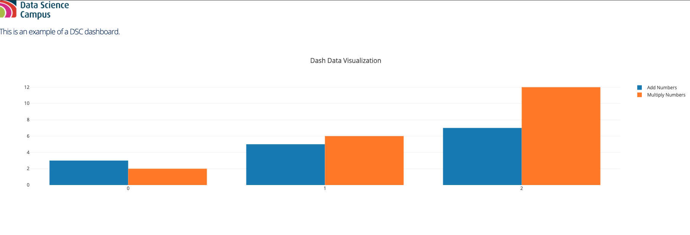
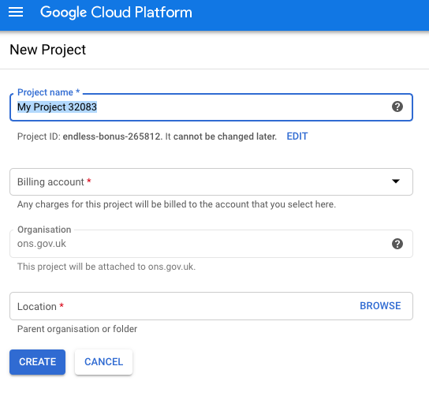
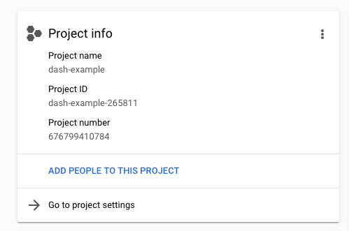
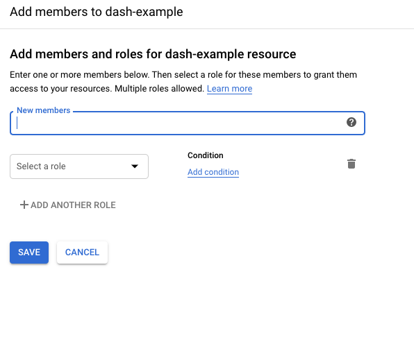

# deploy-dash-with-gcp

This example creates a simple dash application that reads in a locally-stored file in `data` folder and creates a graph from adding and multiplying the numbers in `data.csv`. We then deploy it publically to Google Cloud Platform (GCP).

## Step 1: Test this app locally

1. Clone this repository using `git clone datasciencecampus/deploy-dash-with-gcp.git`

2. Run the python file `main.py` in `/dash` folder.

3. Go to `http://0.0.0.0:8000/` in your browser.

<p align="center"></p>

## Step 2: Deploy your app to Google Cloud Platform

This guide builds on other guides such as [Jamie Phillips'](https://www.phillipsj.net/posts/deploying-dash-to-google-app-engine/). However, we were not able to successfully deploy a dash app following Jamie's, or others, examples without heavy tweaks. We also include additional python functions to load data in our example here (Goodbye, World).

The following steps are to deploy a dash application to GCP. If your app doesn't work locally, you should fix that first as it won't work on GCP (even if you pray real hard). If it works locally, but it doesn't deploy, the majority of the time it will be due to the `app.yaml` file.

### Step 2.1: Make a project on GCP

Using the CLI or the Console Interface online (which we use below), create a new project with a suitable project name (here we call it `dash-example`).

<p align="center"></p>

### Step 2.2: Make yourself the owner of project

Make sure the project you've just created is selected on the console, then click 'ADD PEOPLE TO THIS PROJECT'.

<p align="center"></p>

Then input your user name and set the role to `Project` > `Owner`.

<p align="center"></p>

That's it for now on the Google Cloud Platform Console.

### Step 2.3: Deploy using gcloud command line tool

If you haven't installed the [gcloud command line tool](https://cloud.google.com/sdk/gcloud/) do so now.

Next, check your project is active in gcloud using:

`gcloud config get-value project`

Which will print the following on screen:

```
Your active configuration is: [default]

my-project-id
```

To change the project to your desired project, type:

`gcloud config set project project-id`

Next, to deploy, type:

`gcloud app deploy`

Then select your desired region (we use `europe-west2`, which is the London region)

If you have setup your configuration correctly then it will deploy the dash app (after a while), which will be available at:

`https://project-id.appspot.com/`

<p align="center"></p>

This example is at [https://dash-example-265811.appspot.com/](https://dash-example-265811.appspot.com/) for example.

## Step 3: Edit this app

Important files:

* `main.py` is the dash application
* `.gcloudignore` is like `.gitignore` for GitHub, it tells GCP what not to upload (for example here, I don't want to upload all the screenshots used in this guide)
* `app.yaml` is used to run the dash app on GCP using [gunicorn](https://gunicorn.org/), which is needed for GCP
* `requirements.txt` comprises the packages needed to run the dash app (important: gunicorn is required in this file at the bare minimum)

### main.py

The `main.py` python script comprises the following sections.

*Python functions*

This section has three functions: add numbers, multiply numbers and build banner. The first two are self-explinatory, the last just creates an image banner based on a file in the `assets` folder.

*Load data*

This section either loads the csv file from the local `/data` folder or from your GCP datastore. Then it creates a pandas dataframe and then applies the add and multiply number functions.

*Local data load*

Add the file to the `\data` folder and alter the line:

```
data = os.path.join('data/data.csv')
```

*Load from GCP*

The file `dataDownloader.py` is a python file to download data from GCP. To do this, you need to download a JSON credential file from Google Cloud and tell the script where to find this file.

Add a file called `key_location.json` to the `data/key` folder with the structure:

```
{
  "data": {
    "key_location": "/path/to/file.json"
  }
}
```

Then alter the GCP file location in `main.py`:

```
project_name = 'project-id'
folder_name = 'folder-name'
file_name = 'file-name.csv'
GCP = GCPDownloader()
bytes_file = GCP.getData(project_name, folder_name, file_name)
s = str(bytes_file,'utf-8')
data = StringIO(s)
```

*Upload to GCP*

There are multiple ways to [upload a file to GCP](https://cloud.google.com/storage/docs/uploading-objects), here we include a python script called `dataUpload.py`. Please follow the credential guidelines above.

*Text*

This section just contains free text to append to the dash app.

*Dash*

This contains the dash setup values, including the `/assets` folder.

*Project dashboard*

This is the core of the dash application.

```
app.layout = html.Div(children=[
    html.H1(
        children=[
            build_banner(),
            html.P(
                id='instructions',
                children=dash_text),
            ]
    ),

    dcc.Graph(
        id='example-graph',
        figure={
            'data': [
                {'x': data_df.index.values.tolist(), 'y': data_df['add_num'], 'type': 'bar', 'name': 'Add Numbers'},
                {'x': data_df.index.values.tolist(), 'y': data_df['multiply_num'], 'type': 'bar', 'name': 'Multiply Numbers'},
            ],
            'layout': {
                'title': 'Dash Data Visualization'
            }
        }
    )
])
```

This simply creates the image banner, then adds the free text (which has an `id` whose style can be edited in the `/assets/dsc.css` file, then adds the graph based on the loaded and manipulated data from `/data/datacsv`.

*main*

```
if __name__ == '__main__':
    app.run_server(host='0.0.0.0', port=8000, debug=True)
```

It is important you make a note of the port number and host!


### requirements.txt

Here, this is the `requirements.txt` file, which tells GCP which packages to install.

```
Click==7.0
dash==1.6.0
dash-core-components==1.5.0
dash-html-components==1.0.1
dash-renderer==1.2.0
Flask==1.1.1
Flask-Compress==1.4.0
future==0.18.2
itsdangerous==1.1.0
Jinja2==2.10.3
MarkupSafe==1.1.1
numpy==1.16.5
pandas==0.24.2
pytz==2019.3
retrying==1.3.3
six==1.13.0
Werkzeug==0.16.0
gunicorn==19.3.0
```

### app.yaml

This is a really important file, and needs to replicate what is put in your `main.py` script

```
runtime: python
env: flex
entrypoint: gunicorn -b 0.0.0.0:8000 main:app.server
```

This file tells GCP how to create the application. The first line specifies we want to build using python, the last line must replicate what is at the end of `main.py` (the host and port numbers), as well as what you call the python script (here `main.py` = `main`). This is the most likely file to corrupt a build.


## Step 3: To Do

* Restrict IP addresses.